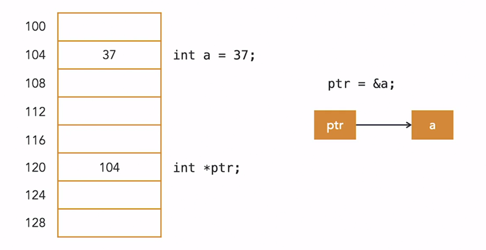

# Pointers and references


# Pointer Basics in C++

Pointers are an essential part of the C programming language, which forms the foundation of C++.
## What Are Pointers?

- Pointers are special variables that hold memory addresses. For example, on 32-bit architectures, pointers are 32 bits wide.

## Memory Organization

- Memory is organized with an address for each byte.
- Addresses are shown in steps of four in our example, as each 32-bit integer occupies four bytes.

## Variable Declaration

- When you declare a 32-bit integer like this: `int a = 37;`, the compiler reserves a memory location for it. Let's say `a` is assigned the address 104, and its content is 37.

## Declaring Pointers

- To declare a pointer, use the following syntax: `type *ptr`, where `type` is the type of variable the pointer will point to, and `ptr` is the name of the pointer variable, preceded by an asterisk.
- Pointers are themselves variables and are allocated at specific memory locations.

## Assigning Addresses to Pointers

- To make a pointer point to a specific address, use the address-of operator (`&`). For example, to make `ptr` point to `a`, you can do it like this: `ptr = &a`.
- The address-of operator (`&`) returns the address of the variable on its right.

## Example

```cpp
int a = 37;         // Declare an integer variable a and initialize it to 37.
int *ptr;           // Declare a pointer to an integer.
ptr = &a;           // Make ptr point to the address of variable a.
```
## Printing Memory Addresses and Contents

Now, let's enhance our understanding by printing the memory addresses and contents of the variables.

### Printing Content of `a`

To display the content of variable `a`, we simply use the variable's name, `a`:

```cpp
cout << "Content of a: " << a << endl;
```
## Printing Address of ptr
To show the address where ptr is pointing, which is essentially the content of the variable ptr:


```c++
cout << "Address of ptr: " << ptr << endl;
```
## Printing Address of a
To display the address of variable `a`, we use the address-of operator (&):

```c++
cout << "Address of a: " << &a << endl;
```
## Printing Content of Memory Address Pointed by ptr
To print the content of the memory address where ptr is pointing, we use the indirection operator (*):

```c++
cout << "Content of the memory address pointed by ptr: " << *ptr << endl;
```
Remember that cout will print an integer for the last value because we declared ptr as a pointer to an integer (int *ptr). Specifying the correct type for the target of a pointer is essential for proper data access and type casting.

## Dynamic memory management
One of the most important applications of pointers is the ability to manage memory more effectively when compared to other languages. Unlike other langjages, C++ requires the developer to remove variables that are not being used to prevent memory leakage. Other languages handle this for you through a garbage collector. A good analogy to think of is managing memory is like a manual vs automatic car: Manual cars allow you to control the gear changes which can you give you more options whilst driving, but is harder to master. In contrast, automatic cars are much esaier to master but gives the develope less control. 
When declaring AND niitilaisein a variable, it is allocates space in memory statically. In other words, the amount of memory required to store a particular object does not change over time. In contrast to dunamic memory management, the data stored can be updated as the code runs, allowing flexibility in how the developer can allocate memory. This is useful as we can control the lifetime of that object. This allows us to write efficient programs compared to python or javacript, because objects typically last the whole program, whereas C++ alows us to control the liftime. See thee xample below:

```c++
my_cow = new cow("Gertie",3,hide);
    cout << my_cow->get_name() << " is a type-" << (int)my_cow->get_purpose() << " cow." << endl;
    cout << my_cow->get_name() << " is " << my_cow->get_age() << " years old." << endl;

    delete my_cow;
```

Here, we have dynamically allocated an instance of the cow class using the new keyword. In python, we would say we have "instantiated" the class. Looking at the second line, we use the arrows to dereference the pointer and call the desired method. Derefencing describes "calling the value" with the de- prefix most likely comes from the Latin preposition meaning from. You could think of dereference as meaning "to obtain the referent (or object) from the reference". Once we are done with allocating our memory, we should clean up by using the `delete` keyword. To prevent memory leakage, make sure you delete any objects that you don't need anymore to prevent memory leakage.

Compare the above code with this one:
```c++
cow my_cow("Hildy",7,pet);
    cout << my_cow.get_name() << " is a type-" << (int)my_cow.get_purpose() << " cow." << endl;
    cout << my_cow.get_name() << " is " << my_cow.get_age() << " years old." << endl;
```

The above allocates my_cow statically and you can tell because:
- There are no `new` or `delete` keywords 
- No arrows to indicate dereferencing a pointer

# Important points about pointers and references
Any good modern C++ programmer will tell you to consider your usage of pointers very carefully and try to avoid them if possible. If you want to just access the information or modify an object, use references. References are simply memory addresses of the object you assign to them, which allows you to create alises of existing objects. The big advantage here is they do not inroduce overhead in terms of memory usage comapred to using original objects directly. In other words, no copying data! You can make a reference using the following syntax:
```c++
   cow my_cow("Gertie",3,hide); // Create a my_cow object
cow& my_cow_ref = my_cow; // Make a reference using the &. Syntax can be thought of make a reference, my_cow_ref, attach (&) the type cow and make it refer to my_cow
cout << my_cow_ref.get_name() << " is a type-" << (int)my_cow_ref.get_purpose() << " cow." << endl; // Usage
```

It's also possible to make temporary references but aren't common practice as they are restrictive (requires to be `const`) and have a very short lifetime which can turn the value of the reference/object to be undefined, potentially leading to undesirable side effects. For completeness, here are the ways to make temporary references:

### 1. Use a const reference:


```c++ const cow& my_cow = cow("Gertie", 3, hide);```
This allows you to bind a const reference to a temporary object, which is safe because it prevents you from modifying the temporary object.

### 2. Create a named object and then use a reference to it:

```c++ 
cow my_cow_instance("Gertie", 3, hide);
auto& my_cow = my_cow_instance;
```
This approach involves creating a named cow object and then creating a reference to that object.

### 3. Use smart pointers (e.g., std::shared_ptr) if appropriate for your use case.


# When should we use dynamic allocation (using new)? 


The important take-home message is that you should **always use the appropriate tool for the job**. In almost all situations, there is something more appropriate and safer than performing manual dynamic allocation and/or using raw pointers.

## Dynamic allocation
The main difference is the storage duration of the object. When doing `Object myObject`; within a block, the object is created with automatic storage duration, which means it will be destroyed automatically when it goes out of scope. When you do `new Object()`, the object has dynamic storage duration, which means it stays alive until you explicitly `delete` it. You should only use dynamic storage duration when you need it. That is, **you should always prefer creating objects with automatic storage duration when you can**.

The main two situations in which you might require dynamic allocation:

1. You need the object to outlive the current scope - that specific object at that specific memory location, not a copy of it. If you're okay with copying/moving the object (most of the time you should be), you should prefer an automatic object.
2. You need to allocate a lot of memory, which may easily fill up the stack. It would be nice if we didn't have to concern ourselves with this (most of the time you shouldn't have to), as it's really outside the purview of C++, but unfortunately, we have to deal with the reality of the systems we're developing for.

When you do absolutely require dynamic allocation, you should encapsulate it in a smart pointer or some other type that performs [RAII](http://en.wikipedia.org/wiki/Resource_Acquisition_Is_Initialization) (like the standard containers). Smart pointers provide ownership semantics of dynamically allocated objects. Take a look at `[std::unique_ptr](http://en.cppreference.com/w/cpp/memory/unique_ptr)` and `[std::shared_ptr](http://en.cppreference.com/w/cpp/memory/shared_ptr)`, for example. If you use them appropriately, you can almost entirely avoid performing your own memory management (see the [Rule of Zero](https://en.cppreference.com/w/cpp/language/rule_of_three)).

# When should we use pointers?

## Pointers
However, there are other more general uses for raw pointers beyond dynamic allocation, but most have alternatives that you should prefer. As before, **always prefer the alternatives unless you really need pointers**.

1. **You need reference semantics**. Sometimes you want to pass an object using a pointer (regardless of how it was allocated) because you want the function to which you're passing it to have access that that specific object (not a copy of it). However, in most situations, you should prefer reference types to pointers, because this is specifically what they're designed for. Note this is not necessarily about extending the lifetime of the object beyond the current scope, as in situation 1 above. As before, if you're okay with passing a copy of the object, you don't need reference semantics.

2. **You need polymorphism**. You can only call functions polymorphically (that is, according to the dynamic type of an object) through a pointer or reference to the object. If that's the behavior you need, then you need to use pointers or references. Again, references should be preferred.

3. **You want to represent that an object is optional** by allowing a `nullptr` to be passed when the object is being omitted. If it's an argument, you should prefer to use default arguments or function overloads. Otherwise, you should preferably use a type that encapsulates this behavior, such as `std::optional` (introduced in C++17 - with earlier C++ standards, use `boost::optional`).

4. **You want to decouple compilation units to improve compilation time**. The useful property of a pointer is that you only require a forward declaration of the pointed-to type (to actually use the object, you'll need a definition). This allows you to decouple parts of your compilation process, which may significantly improve compilation time. See the [Pimpl idiom](http://en.wikipedia.org/wiki/Opaque_pointer).

5. **You need to interface with a C library or a C-style library**. At this point, you're forced to use raw pointers. The best thing you can do is make sure you only let your raw pointers loose at the last possible moment. You can get a raw pointer from a smart pointer, for example, by using its `get` member function. If a library performs some allocation for you which it expects you to deallocate via a handle, you can often wrap the handle up in a smart pointer with a custom deleter that will deallocate the object appropriately.

## Further points
Using pointers for resource acquisition. Creating a pointer to a resource using the new operator is an anti-pattern in modern C++. Use a special resource class (one of the Standard containers) or a smart pointer (`std::unique_ptr<>` or `std::shared_ptr<>`)
Anti-pattern:
```c++
{
    auto b = new Base;
    ...       // oops, if an exception is thrown, destructor not called!
    delete b;
}
```
Much better:
```c++
{
    auto b = std::make_unique<Base>();
    ...       // OK, now exception safe
}
```
A raw pointer should only be used as a "view" and not in any way involved in ownership, be it through direct creation or implicitly through return values. See also this Q&A from the C++ FAQ.

Pointers allow more fine-grained life-time control. Every time a shared pointer is being copied (e.g. as a function argument) the resource it points to is being kept alive. Regular objects (not created by new, either directly by you or inside a resource class) are destroyed when going out of scope.

# Further reading
https://stackoverflow.com/questions/22146094/why-should-i-use-a-pointer-rather-than-the-object-itself
