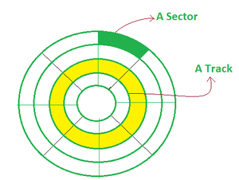

# Key computing notes
C++ offers a lot of power and flexibility to the developer. This is because C++ is a much lower level programming 
compared to python, javascript and C#. C++ achieves this by allowing developers to access memory through pointers. However,
this flexibility comes at a cost - you need to be aware of computer memory usage!

For example, let's revisit the basics on computer memory.
(Source: Geeks for geeks)

A computer is an electronic device and that accepts data, processes on that data, and gives the desired output. It performs programmed computation with accuracy and speed. Or in other words, the computer takes data as input and stores the data/instructions in the memory (use them when required). After processes the data, it converts into information. Finally, gives the output.

Here, input refers to the raw data that we want the machine to process and return to us as a result, output refers to the response that the machine provides in response to the raw data entered and the processing of data may involve analyzing, searching, distributing, storing data, etc. Thus, we can also call a computer data processing system.

## What is Computer Memory?
Computer memory is just like the human brain. It is used to store data/information and instructions. It is a data storage unit or a data storage device where data is to be processed and instructions required for processing are stored. It can store both the input and output can be stored here.

## Characteristics of Computer Memory
- It is faster computer memory as compared to secondary memory.
- It is semiconductor memories.
- It is usually a volatile memory, and main memory of the computer.
- A computer system cannot run without primary memory.

## How Does Computer Memory Work?
When you open a program, it is loaded from secondary memory into primary memory. Because there are various types of memory and storage, an example would be moving a program from a solid-state drive (SSD) to RAM. Because primary storage is accessed more quickly, the opened software can connect with the computer’s processor more quickly. The primary memory is readily accessible from temporary memory slots or other storage sites.

Memory is volatile, which means that data is only kept temporarily in memory. Data saved in volatile memory is automatically destroyed when a computing device is turned off. When you save a file, it is sent to secondary memory for storage.

There are various kinds of memory accessible. It’s operation will depend upon the type of primary memory used. but normally, semiconductor-based memory is more related with memory. Semiconductor memory made up of IC (integrated circuits) with silicon-based metal-oxide-semiconductor (MOS) transistors.

## Types of Computer Memory
In general, computer memory is of three types:

- [Primary memory](https://www.geeksforgeeks.org/primary-memory/)
- [Secondary memory](https://www.geeksforgeeks.org/secondary-memory/)
- [Cache memory](https://www.geeksforgeeks.org/cache-memory/)

Now we discuss each type of memory one by one in detail:

## 1. Primary Memory
   It is also known as the main memory of the computer system. It is used to store data and programs or instructions during computer operations. It uses semiconductor technology and hence is commonly called semiconductor memory. Primary memory is of two types:

- **RAM (Random Access Memory)**: It is a volatile memory. Volatile memory stores information based on the power supply. If the power supply fails/ interrupted/stopped, all the data and information on this memory will be lost. RAM is used for booting up or start the computer. It temporarily stores programs/data which has to be executed by the processor. RAM is of two types:
  *  S RAM (Static RAM): S RAM uses transistors and the circuits of this memory are capable of retaining their state as long as the power is applied. This memory consists of the number of flip flops with each flip flop storing 1 bit. It has less access time and hence, it is faster.
  * D RAM (Dynamic RAM): D RAM uses capacitors and transistors and stores the data as a charge on the capacitors. They contain thousands of memory cells. It needs refreshing of charge on capacitor after a few milliseconds. This memory is slower than S RAM.
  

- ROM (Read Only Memory): It is a non-volatile memory. Non-volatile memory stores information even when there is a power supply failed/ interrupted/stopped. ROM is used to store information that is used to operate the system. As its name refers to read-only memory, we can only read the programs and data that is stored on it. It contains some electronic fuses that can be programmed for a piece of specific information. The information stored in the ROM in binary format. It is also known as permanent memory. ROM is of four types:
  * MROM(Masked ROM): Hard-wired devices with a pre-programmed collection of data or instructions were the first ROMs. Masked ROMs are a type of low-cost ROM that works in this way.
  * PROM (Programmable Read Only Memory): This read-only memory is modifiable once by the user. The user purchases a blank PROM and uses a PROM program to put the required contents into the PROM. Its content can’t be erased once written.
  * EPROM (Erasable Programmable Read Only Memory): EPROM is an extension to PROM where you can erase the content of ROM by exposing it to Ultraviolet rays for nearly 40 minutes.
  * EEPROM (Electrically Erasable Programmable Read Only Memory): Here the written contents can be erased electrically. You can delete and reprogramme EEPROM up to 10,000 times. Erasing and programming take very little time, i.e., nearly  4 -10 ms(milliseconds). Any area in an EEPROM can be wiped and programmed selectively.

## 2. Secondary Memory
It is also known as auxiliary memory and backup memory. It is a non-volatile memory and used to store a large amount of data or information. The data or information stored in secondary memory is permanent, and it is slower than primary memory. A CPU cannot access secondary memory directly. The data/information from the auxiliary memory is first transferred to the main memory, and then the CPU can access it.

### Characteristics of Secondary Memory

- It is a slow memory but reusable.
- It is a reliable and non-volatile memory.
- It is cheaper than primary memory.
- The storage capacity of secondary memory is large.
- A computer system can run without secondary memory.
In secondary memory, data is stored permanently even when the power is off.

### Types of Secondary Memory

1. Magnetic Tapes: Magnetic tape is a long, narrow strip of plastic film with a thin, magnetic coating on it that is used for magnetic recording. Bits are recorded on tape as magnetic patches called RECORDS that run along many tracks. Typically, 7 or 9 bits are recorded concurrently. Each track has one read/write head, which allows data to be recorded and read as a sequence of characters. It can be stopped, started moving forward or backward, or rewound.

2. Magnetic Disks: A magnetic disk is a circular metal or a plastic plate and these plates are coated with magnetic material. The disc is used on both sides. Bits are stored in magnetized surfaces in locations called tracks that run in concentric rings. Sectors are typically used to break tracks into pieces.

3. Optical Disks: It’s a laser-based storage medium that can be written to and read. It is reasonably priced and has a long lifespan. The optical disc can be taken out of the computer by occasional users.

## Types of Optical Disks

### CD – ROM

It’s called compact disk. Only read from memory.
Information is written to the disc by using a controlled laser beam to burn pits on the disc surface.
It has a highly reflecting surface, which is usually aluminium.
The diameter of the disc is 5.25 inches.
16000 tracks per inch is the track density.
The capacity of a CD-ROM is 600 MB, with each sector storing 2048 bytes of data.
The data transfer rate is about 4800KB/sec. & the new access time is around 80 milliseconds.

### WORM-(WRITE ONCE READ MANY)

A user can only write data once.
The information is written on the disc using a laser beam.
It is possible to read the written data as many times as desired.
They keep lasting records of information but access time is high.
It is possible to rewrite updated or new data to another part of the disc.
Data that has already been written cannot be changed.
Usual size – 5.25 inch or 3.5 inch diameter.
The usual capacity of 5.25 inch disk is 650 MB,5.2GB etc.

### DVDs

The term “DVD” stands for “Digital Versatile/Video Disc,” and there are two sorts of DVDs:
- DVDR (writable)
- DVDRW (Re-Writable)
- **DVD-ROMS (Digital Versatile Discs)**: These are read-only memory (ROM) discs that can be used in a variety of ways. When compared to CD-ROMs, they can store a lot more data. It has a thick polycarbonate plastic layer that serves as a foundation for the other layers. It’s an optical memory that can read and write data.
- **DVD-R**: DVD-R is a writable optical disc that can be used just once. It’s a DVD that can be recorded. It’s a lot like WORM. DVD-ROMs have capacities ranging from 4.7 to 17 GB. The capacity of 3.5 inch disk is 1.3 GB.
# 3. Cache Memory
It is a type of high-speed semiconductor memory that can help the CPU run faster. Between the CPU and the main memory, it serves as a buffer. It is used to store the data and programs that the CPU uses the most frequently.

### Advantages of Cache Memory

- It is faster than the main memory.
- When compared to the main memory, it takes less time to access it.
- It keeps the programs that can be run in a short amount of time.
- It stores data in temporary use.
### Disadvantages of Cache Memory

- Because of the semiconductors used, it is very expensive.
- The size of the cache (amount of data it can store) is usually small.

# FAQs on Computer Memory
#### Q.1: What is Volatile and Non Volatile memory?
#### Answer:

Volatile memory is used to store information based on power supply. If the power supply is off, all the data and information on this memory will be lost. For example, RAM (Random Access Memory). Whereas non-volatile memory is used to store information even when the power supply is off. For example, ROM (Read Only Memory).

### Q.2: How many 128 * 8 memory chips are required for a memory capacity of 4096*16?
### Answer:

Number of chips required = Required RAM size/ Available chip capacity

= (4096 * 16)/(128 * 8) = 64

### Q.3: Explain any four differences between RAM and ROM?
### Answer:

# RAM ROM
- It stands for Random access memory.	It stands for read only memory.
- It is the fastest memory.	It is slower memory as compare to RAM.
- It is volatile memory.	It is non-volatile memory.
- In this memory, data will erase when the power is off	In this memory, data will not erase even if the power is off

### Q.4: How to erase data in EPROM?
### Answer:

In EPROM, using ultraviolet rays we can easily erase data.